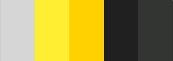

## Table of Contents
1. [UX](#ux)
    - [Goals](#goals)
        - [Visitor Goals](#visitor-goals)
        - [Member Goals](#member-goals)
        - [Business Goals](#business-goals)
    - [Design Choices](#design-choices)
        - [Fonts](#fonts)
        - [Icons](#icons)
        - [Colours](#colours)
        - [Images](#images)
    - [Wireframes](#wireframes)

2. [Features](#features)
    - [Existing Features](#existing-features)
    - [Features Left to Implement](#features-left-to-implement)

3. [Technologies Used](#technologies-used)

4. [Testing](#testing)
    - [Validations](#validations)
5. [Deployment](#deployment)
    - [How to run this project locally](#how-to-run-this-project-locally)

6. [Credits](#credits)
    - [Content](#content)
    - [Images](#images)
    - [Code](#code)
    - [Acknowledgements](#acknowledgements)

7. [Contact](#contact)

----

# UX

## Goals

### Visitor Goals

 As a visitor, I want to:
 - Be able to easily navigate and find vital content.
 - Easily understand the site and learn more about the organisation.
 - Be able to find the opening hours and how the gym works.
 - Be able to find prices and avaiable plans and benefits about the gym.
 - Be able to get in touch and solve whatever doubt may I have.
 - Be able to find SafeGym social media links.
 - Be able to subscript the Newsletter. **

### Member Goals **

 As a Gym Member I want to:
 - Discover more about my rights and benefits. **
 - Be able to manage my workout bookings. **
 - Know about the next gym events and Gym news. **
 - Have access to my contract. **
 - Manage details about my payments. **

### Business Goals

 The Goals of the SafeGym are:
 - Provide a advertisement place that helps the user to gaint trust that they are doing the right choice. 
 - Build brand recognition by including all the branding colours, fonts and logo associated with the SafeGym brand.
 - Connect to interested people, members and former gym members through the SafeGym social media channels.

 ** This Goals are listed at Features section as Future Implements

### Design Choices
#### Fonts
 - The selected font was [Roboto](https://fonts.google.com/specimen/Roboto) from **Google Fonts**.

#### Icons
 The selected icons was found at [Fontawesome](https://fontawesome.com/) and they are related to a gym or the safe measures of Covid-19.
 - [Dumbell](https://fontawesome.com/icons/dumbbell?style=solid)
 - [Mask](https://fontawesome.com/icons/head-side-mask?style=solid)
 - [Temperature](https://fontawesome.com/icons/temperature-low?style=solid)
 - [Hands](https://fontawesome.com/icons/hands-wash?style=solid)
 - [Arrow](https://fontawesome.com/icons/people-arrows?style=solid)

#### Colours
 
 - [Color Scheme](https://coolors.co/d6d6d6-ffee32-ffd100-202020-333533).
 
    
 
#### Images
 - [Gym](https://pixahive.com/photo/gym/)
 - [Jonathan Borba](https://unsplash.com/@jonathanborba?utm_source=unsplash&amp;utm_medium=referral&amp;utm_content=creditCopyText)
 - [Matthew Sichkaruk](https://unsplash.com/@sichpicsss?utm_source=unsplash&amp;utm_medium=referral&amp;utm_content=creditCopyText)

### Wireframes

The wireframes were created using [Balsamiq](https://balsamiq.com/) and hosted at [Imgbb](https://imgbb.com).

 - [Home](https://ibb.co/YZCbc9P)
 - [Plans](https://ibb.co/Gvmz7dK)
 - [Contact](https://ibb.co/y5tNBXL)

## Features
  - The website main feature it is the advertisement, brand hype,
  share the social media channels and to provide vital information about the gym.

### Features Left to Implement
 - Newsletter

    - Newsletter Subscritions

 - Carrer section

 - Member Sing Up page

 - Member area

    - Member sing in
    - Account management
    - Workout booking section
    - Member special offers, sales and plans
    - Manage payment details
    - Payment history
 
## Technologies Used

 - This project uses HTML, CSS and JavaScript programming languages.

 - [Gitpod](https://gitpod.io/)
    - Developer used **Gitpod** as IDE to build the website.
 - [Bootstrap](https://www.bootstrapcdn.com/)
    - The project uses **Bootstrap** to simplify the development process and make the website responsive easily.
    - The project also uses Bootstrap to provide icons from [FontAwesome](https://www.bootstrapcdn.com/fontawesome/)
 - [Google Fonts](https://fonts.google.com/)
    - The project uses **Google fonts** to style the website fonts.
 - [Imgbb](https://imgbb.com)
    - All external images for this project are stored on **Imgbb**.
 - [GitHub](https://github.com/)
    - This project uses **GitHub** to store and share all project code remotely.
 - [Balsamiq](https://balsamiq.com/)
    - The Wireframes was created using **Balsamiq**.
 - [Coolors](https://coolors.co/)
    - The **Coolors** was used to define the project color scheme.
 - [W3C HTML Validator](https://validator.w3.org/)
    - The **W3C HTML Validator** was used to validate the project html.
 - [W3C CSS Validator](https://jigsaw.w3.org/css-validator/)
    - The **W3C CSS Validator** was used to validate the project css.
 - [Pixels Converter](https://pixelsconverter.com/px-to-rem)
    - The **Pixels Converter** was used to change pixels to rem.
 - [Auto Prefixer](https://autoprefixer.github.io)
    - The **Auto Prefixer** was used to parse the CSS and adds vendor prefixes.

## Testing
  - All informations about test are located at [Testing.md](testing.md) file.

### Validations     
  - When performing the site validation as much from HTML as in CSS I came across: 

        HTML (First and Final Check)
        4 Warnings from:
          - Empty heading. 
                From line 108, column 29; to line 108, column 51.
                From line 117, column 29; to line 117, column 51.
                From line 126, column 29; to line 126, column 51.
                From line 135, column 29; to line 135, column 51.

                <h5 class="card-title"><i cla
         
        CSS
        First Check
            Some Errors as:
            - Alphabetical order from CSS properties.
            - Don't use ID in selectors.
            - Too many font-size declarations, abstraction needed.
        
        Final Check
        18 errors from:
            - URI https://cdn.jsdelivr.net/npm/bootstrap@5.0.0-beta1/dist/css/bootstrap.min.css
        424 Warnings from:
            - URI https://cdn.jsdelivr.net/npm/bootstrap@5.0.0-beta1/dist/css/bootstrap.min.css
            - URI https://use.fontawesome.com/releases/v5.15.1/css/all.css

## Deployment
 - The project was developed using [Gitpod](https://gitpod.io/) commited to **git**,
  pushed to [GitHub](https://github.com/) and deployed at [GitHub Pages](https://pages.github.com/).

 - To deploy to [GitHub Pages](https://pages.github.com/) was used the these steps 
 [here](https://docs.github.com/en/github/working-with-github-pages/creating-a-github-pages-site).

### How to run this project locally
 - [SafeGym Repository](https://github.com/brunobdias/safe-gym)

 - To clone this Repository follow this steps:
    - [Clone Repository](https://help.github.com/en/articles/cloning-a-repository)

## Credits
 - [CodeInstitue](https://codeinstitute.net/)
 - [Balsamiq](https://balsamiq.com/)
 - [Fontawesome](https://fontawesome.com/)
 - [Google Fonts](https://fonts.google.com/)
 - [Coolors](https://coolors.co/)
 - [StackOverflow](https://stackoverflow.com/)
 - [w3Schools](https://www.w3schools.com/)
 - [imgbb](https://ibb.co/)
 - [Bootstrap](https://getbootstrap.com/)
 - [Gitpod](https://gitpod.io/)
 - [GitHub](https://github.com/)
 - [Unsplash](https://unsplash.com)
 - [Pixahive](https://pixahive.com/)
 - [Markuptag](https://www.markuptag.com/bootstrap-5-badges-over-button/)
 - [Auto Prefixer](https://autoprefixer.github.io)

### Code
 - The code were developed on [Gitpod](https://gitpod.io/) hosted at [GitHub](https://github.com/) and deployed at [GitHub Pages](https://pages.github.com/), written  based at previous classes at [CodeInstitue](https://codeinstitute.net/),
 with the assistance of [w3Schools](https://www.w3schools.com/), [StackOverflow](https://stackoverflow.com/),
 [Bootstrap](https://getbootstrap.com/) and [Markuptag](https://www.markuptag.com/), with documentation and samples to understand some resourses and to help on bug fixes.

### Acknowledgements
 Special thanks to: 
 - My Mentor [Spencer Barriball](https://github.com/5pence) from Code Institute for his time, support, assistance and expertise in explaining and guide me through 
 the milestone project.
 - The Student Care Team from Code Institute, 
 to [Anna Greaves](https://github.com/AJGreaves) and 
 [Jim Morel](https://github.com/JimLynx) 
 from all provided content and calls to assist all fellow students.

### Disclaimer
 - The content of this website, including the images used, are for educational purposes only.
