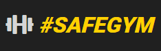
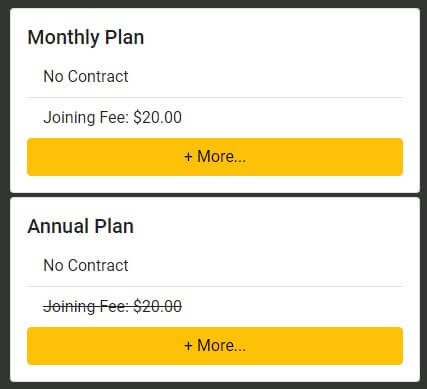
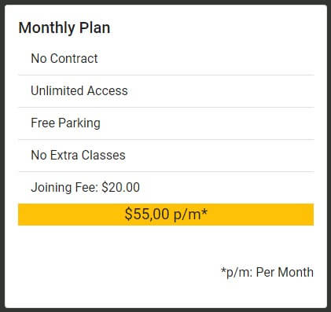
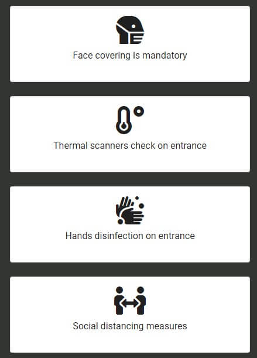
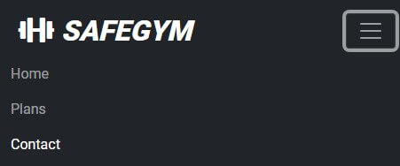

## Table of Contents

1. [Testing](#testing)
    - [User Stories](#user-stories)

----

## Testing

  - On a Mobile Phone
    - The test was realized at a Android system Samsung Galaxy A70, on the Google Chrome
        Browser.
  
  - On a PC
    - The test was realized at a Windows 10 operational system, on the follow browsers:
    Google Chrome, Microsoft Edge, Microsoft Internet Explorer, Mozzila Firefox and Opera.

    - Google Chrome was also used to simulate other platforms as Iphone X, Ipad, Surface Duo.

  - Observations of testing
    - The Website had the same behavior at all browsers, except on Microsoft Internet Explorer
    on the margins beetween the cards, with all cards together, sample above.

    
 
## User Stories
    Visitor Goals

    As a visitor, I want to:
    - Be able to easily navigate and find vital content.
        - On a Mobile Phone
            When accessing the home page:
                - Header
                    - You will see the navbar with the SAFEGYM logo that works as a
                    homepage button, on the right corner the burguer button that
                    when clicked will list all pages to navigate through the site, 
                    this pages are Home, Plans and Contact with a highlight on the 
                    current page, on this case the "Home".
                    - If Clicked at Plans is redirected to the plans page.
                    - If Clicked at Contact is redirected to the contact page.
                    

 
                - Section
                    - Scrolling down the page there is the main logo of the SAFEGYM,
                    follow by the carousel, with some pictures to show a little bit
                    from the gym.

                    - Scrolling down there is a preview from the gym plans 
                    monthly and annual, followed by buttons to show more about the plans.
                    - Scrolling down there are the cards about the safe measures to prevent 
                    from COVID-19, as such the card from face covering, thermal scanners,
                    hands desinfection, and social distancing measures.

                - Footer
                    - Scrolling down start the footer with the opening hours, followed
                    by a logo with the hash (#SAFEGYM) to indicate the next section of
                    social medias, with the link to Instagram, Facebook, Twitter and 
                    Youtube, all the links are opening in new tabs, don't losing the
                    current page.

            When Clicked on the Burguer Button and selected the Plans page, or clicked
            at the button "+More..." On the plans cards at the home page, 
            is redirected to Plans page:
                
                - Header
                    - You will see the navbar with the SAFEGYM logo that works as a
                    homepage button, on the right corner the burguer button that
                    when clicked will list all pages to navigate through the site, 
                    this pages are Home, Plans and Contact with a highlight on the 
                    current page, on this case the "Plans".
                    - If Clicked at Home is redirected to the home page.
                    - If Clicked at Contact is redirected to the contact page.

                - Section
                    - Scrolling down the page there is the main logo of the SAFEGYM.

                    

                    - Scrolling down there is the card of the monthly plan,
                    with all descriptions of the plan and the price.

 

                    - Scrolling down there is the card of the annual plan,
                    with a badge incating the best option, all descriptions of the plan 
                    and the price.

                    - Scrolling down there are the cards about the safe measures to prevent 
                    from COVID-19, as such the card from face covering, thermal scanners,
                    hands desinfection, and social distancing measures.

                - Footer
                    - Scrolling down start the footer with the opening hours, followed
                    by a logo with the hash (#SAFEGYM) to indicate the next section of
                    social medias, with the link to Instagram, Facebook, Twitter and 
                    Youtube, all the links are opening in new tabs, don't losing the
                    current page.

            When Clicked on the Burguer Button and selected the Contact page, 
            is redirected to Contact page:

                - Header
                    - You will see the navbar with the SAFEGYM logo that works as a
                    homepage button, on the right corner the burguer button that
                    when clicked will list all pages to navigate through the site, 
                    this pages are Home, Plans and Contact with a highlight on the 
                    current page, on this case the "Contact".
                    - If Clicked at Home is redirected to the home page.
                    - If Clicked at Plans is redirected to the plan page.    

                    

                - Section
                    - Scrolling down the page there is the main logo of the SAFEGYM.

                    

                    - Scrolling down there is a form to contact the gym, with the
                    following fields, Name, Email and Comments, and a Submit Button.
                    All fields are required in any case of empty, and the email of empty or
                    not have at least some conten and the "@" symbol on the email.
                    
                                        
                    
                    - Scrolling down there is the address and the phone to contact the gym,
                    on case of clicking on the phone the page redirect to the dialler of the
                    mobile device.

                    

                    - Scrolling down there are the cards about the safe measures to prevent 
                    from COVID-19, as such the card from face covering, thermal scanners,
                    hands desinfection, and social distancing measures.

                    

                - Footer
                    - Scrolling down start the footer with the opening hours, followed
                    by a logo with the hash (#SAFEGYM) to indicate the next section of
                    social medias, with the link to Instagram, Facebook, Twitter and 
                    Youtube, all the links are opening in new tabs, don't losing the
                    current page.

                    
                        
        - On PC
            When accessing the home page:
                - Header
                    - You will see the navbar with the SAFEGYM logo that works as a
                    homepage button, and the other pages to navigate through the site, 
                    this pages are Home, Plans and Contact with a highlight on the 
                    current page, on this case the "Home".
                    - If Clicked at Plans is redirected to the plans page.
                    - If Clicked at Contact is redirected to the contact page.
                - Section
                    - Scrolling down the page there is the main logo of the SAFEGYM,
                    follow by the carousel, with some pictures to show a little bit
                    from the gym.
                    - Scrolling down there is a preview from the gym plans 
                    monthly and annual, followed by buttons to show more about the plans.
                    - Scrolling down there are the cards about the safe measures to prevent 
                    from COVID-19, as such the card from face covering, thermal scanners,
                    hands desinfection, and social distancing measures.
                - Footer
                    - Scrolling down start the footer with the opening hours, followed
                    by a logo with the hash (#SAFEGYM) to indicate the next section of
                    social medias, with the link to Instagram, Facebook, Twitter and 
                    Youtube, all the links are opening in new tabs, don't losing the
                    current page.

            When Clicked at the Plans page, or clicked at the button "+More..." 
            On the plans cards at the home page, is redirected to Plans page:
                
                - Header
                    - You will see the navbar with the SAFEGYM logo that works as a
                    homepage button, and the other pages to navigate through the site, 
                    this pages are Home, Plans and Contact with a highlight on the 
                    current page, on this case the "Plans".
                    - If Clicked at Home is redirected to the home page.
                    - If Clicked at Contact is redirected to the contact page.
                - Section
                    - Scrolling down the page there is the main logo of the SAFEGYM.
                    - Scrolling down there is the gym plans.
                    - At the left there is the card of the monthly plan,
                    with all descriptions of the plan and the price.
                    - At the right there is the card of the annual plan,
                    with a badge incating the best option, all descriptions of the plan 
                    and the price.
                    - Scrolling down there are the cards about the safe measures to prevent 
                    from COVID-19, as such the card from face covering, thermal scanners,
                    hands desinfection, and social distancing measures.
                - Footer
                    - Scrolling down start the footer with the opening hours, followed
                    by a logo with the hash (#SAFEGYM) to indicate the next section of
                    social medias, with the link to Instagram, Facebook, Twitter and 
                    Youtube, all the links are opening in new tabs, don't losing the
                    current page.

            When Clicked at the Contact page, is redirected to Contact page:

                - Header
                    - You will see the navbar with the SAFEGYM logo that works as a
                    homepage button, and the other pages to navigate through the site, 
                    this pages are Home, Plans and Contact with a highlight on the 
                    current page, on this case the "Contact".
                    - If Clicked at Home is redirected to the home page.
                    - If Clicked at Plans is redirected to the plan page.                        
                - Section
                    - Scrolling down the page there is the main logo of the SAFEGYM.
                    - Scrolling down there is a form to contact the gym, with the
                    following fields, Name, Email and Comments, and a Submit Button.
                    All fields are required in any case of empty, and the email of empty or
                    not have at least some conten and the "@" symbol on the email.
                    - Scrolling down at the left corner there is the address and the phone 
                    to contact the gym, on case of clicking on the phone the page ask to
                    select an app dialler on the browser.
                    - Scrolling down there are the cards about the safe measures to prevent 
                    from COVID-19, as such the card from face covering, thermal scanners,
                    hands desinfection, and social distancing measures.
                - Footer
                    - Scrolling down start the footer with the opening hours, followed
                    by a logo with the hash (#SAFEGYM) to indicate the next section of
                    social medias, with the link to Instagram, Facebook, Twitter and 
                    Youtube, all the links are opening in new tabs, don't losing the
                    current page.

    - Easily understand the site and learn more about the organisation.

        - On a Mobile Phone or on PC, the site is easy to understand and find out
        more about with a navbar easy to navigate.
        At home page there is a carousel with some images,cards about plans,
        and safe measures about COVID-19, with the opening hours
        demonstrated at all pages on footer and all social links displayed at footer
        of all pages.
        At the plans page you can find all information about the plans with advantages,
        benefits, the price, and a badge to suggest the best option.
        At the Contact page you can find a form to fill and get in touch with the gym,
        the address and phone to get in touch the way the visitor think it is the best.

    - Be able to find the opening hours and how the gym works.
        
        - On a Mobile Phone or on PC the opening hours are demonstrated at the
        footer of all pages.

    - Be able to find prices and avaiable plans and benefits about the gym.
        
        - On a Mobile Phone or on PC at the plans page you can find all 
        information about the plans with advantages, benefits, the price, 
        and a badge to suggest the best option.

    - Be able to get in touch and solve whatever doubt may I have.
        
        - On a Mobile Phone or on PC at the Contact page you can find a form 
        to fill and get in touch with the gym, the address and phone to get in touch 
        the way the visitor think it is the best.

    - Be able to find SafeGym social media links.
        - On a Mobile Phone or on PC at all pages the visitor can find at the
        footer the links to all social medias